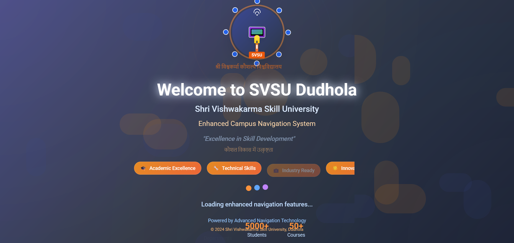
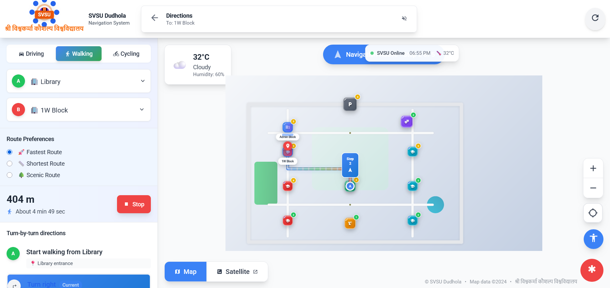

# 🧭 SVSU Dudhola Campus Navigation System
A Google Maps-style interactive navigation system for Shri Vishwakarma Skill University featuring real-time pathfinding, voice guidance, and multi-modal routing powered by Dijkstra's algorithm.


---

## 📋 Table of Contents
- [Overview](#-overview)
- [Features](#-features)
- [Installation](#-installation)
- [Project Structure](#-project-structure)
- [Navigation Modes](#-navigation-modes)
- [Technologies Used](#-technologies-used)
- [Screenshots](#-screenshots)
- [Troubleshooting](#-troubleshooting)
- [Known Issues & Limitations](#-known-issues--limitations)
- [Future Improvements](#-future-improvements)
- [Browser Compatibility](#-browser-compatibility)
- [License](#-license)
- [Authors](#-authors)
- [Contact](#-contact)

---

## 🌟 Overview

The SVSU Dudhola Campus Navigation System is a cutting-edge, web-based navigation solution designed specifically for **Shri Vishwakarma Skill University (SVSU)** in Dudhola, Haryana. This system transforms campus navigation by providing students, faculty, and visitors with an intuitive, Google Maps-inspired interface for finding buildings, calculating optimal routes, and receiving turn-by-turn directions.

### What Makes This System Special?

Unlike generic mapping solutions, this system is:
- **Campus-Specific**: Tailored precisely to SVSU's layout with 11 mapped buildings
- **Intelligent Routing**: Uses Dijkstra's algorithm for optimal path calculation
- **Multi-Modal**: Supports walking, cycling, and driving routes
- **Accessible**: Voice navigation, high contrast mode, and keyboard navigation
- **Real-Time**: Live weather updates and building occupancy information

### University Context

**Shri Vishwakarma Skill University (SVSU)**
- **Location**: Dudhola, Palwal, Haryana, India
- **Coordinates**: 28.4089°N, 77.0378°E
- **Focus**: Excellence in Skill Development
- **Motto**: *"कौशल विकास में उत्कृष्टता"* (Excellence in Skill Development)

---

## ✨ Features

### 🗺️ Navigation Features
- **Real-time Pathfinding**: Dijkstra's algorithm calculates optimal routes between any two points
- **Turn-by-Turn Directions**: Step-by-step navigation instructions with distance markers
- **Multiple Route Options**: Fastest, Shortest, and Scenic routes
- **Live Position Tracking**: GPS-based real-time location updates
- **Route Visualization**: Animated path display with color-coded segments

### 🎤 Voice & Accessibility
- **Voice Navigation**: Text-to-speech turn-by-turn guidance
- **Voice Search**: Speech recognition for hands-free destination selection
- **High Contrast Mode**: Enhanced visibility for visually impaired users
- **Large Text Mode**: Improved readability
- **Reduce Motion**: Accessibility option for users sensitive to animations
- **Keyboard Navigation**: Full keyboard support for all features

### 🚶 Transport Modes
- **Walking Mode**: Optimized pedestrian routes (avg. 5 km/h)
- **Cycling Mode**: Bike-friendly paths (avg. 15 km/h)
- **Driving Mode**: Vehicle routes (avg. 40 km/h)

### 🌐 Map Views
- **Standard Map View**: Clean, Google Maps-inspired design
- **Satellite View**: Realistic aerial perspective
- **Interactive Buildings**: Click any building for detailed information
- **Zoom Controls**: Smooth zoom in/out functionality

### 📊 Building Information
- **11 Campus Buildings** fully mapped
- Real-time occupancy, operating hours, facilities, and ratings

---

## 🚀 Installation

### Prerequisites
- Web Browser: Chrome 90+, Edge 90+, Firefox 88+, or Safari 14+
- Modern Device: 4GB+ RAM recommended
- Internet Connection: For CDN resources
- GPS-Enabled Device: Optional, for location services

### Quick Start

**Option 1: Direct File Access**

```bash
# Clone the repository
git clone https://github.com/yourusername/svsu-navigation-system.git
cd svsu-navigation-system

# Open index.html in your browser
# macOS: open index.html
# Linux: xdg-open index.html
# Windows: start index.html
```

**Option 2: Local Web Server**

```bash
# Using Python 3
python -m http.server 8000

# Using Node.js
npx http-server -p 8000

# Visit http://localhost:8000
```

**Option 3: GitHub Pages**
1. Fork the repository
2. Enable GitHub Pages in Settings
3. Access at `https://yourusername.github.io/svsu-navigation-system`

---

## 📁 Project Structure

```
svsu-navigation-system/
├── index.html              # Main application (single file)
├── README.md               # Documentation
├── LICENSE                 # MIT License
└── assets/                 # Images and icons
    └── images/
        ├── welcome_page.png
        ├── home_page.png
        └── result_page.png
```

---

## 🚶 Navigation Modes

- **Walking Mode**: Optimized for pedestrians (5 km/h average)
- **Cycling Mode**: Bike-friendly routes (15 km/h average)
- **Driving Mode**: Vehicle routes (40 km/h average, campus limit: 20 km/h)

---

## 🛠️ Technologies Used

- **React 18.2.0**: Frontend framework
- **Tailwind CSS 3.3.0**: Styling
- **Lucide React 0.263.1**: Icons
- **Dijkstra's Algorithm**: Pathfinding
- **Web APIs**: Geolocation, Speech Recognition, Speech Synthesis, Local Storage

---

## 📸 Screenshots

### Welcome Screen


### Main Navigation Interface


### Active Navigation


### Reached


---

## 🔧 Troubleshooting

### Location Services Not Working
1. Check browser location permissions (click lock icon in address bar)
2. Ensure GPS is enabled on your device
3. Use HTTPS or localhost for geolocation API
4. Try a different browser (Chrome/Edge recommended)

### Voice Navigation Issues
1. Voice search requires Chrome/Edge (not supported in Firefox/Safari)
2. Grant microphone permissions in browser settings
3. Ensure device volume is turned up
4. Check that microphone is working in other apps

### Routes Not Calculating
1. Ensure different start and end points are selected
2. Move markers at least 10 meters apart
3. Try refreshing the page (F5)
4. Check browser console (F12) for errors

### Performance Issues
1. Close unnecessary browser tabs
2. Enable "Reduce Motion" in settings
3. Use Standard map view instead of Satellite
4. Clear browser cache and reload

---

## ⚠️ Known Issues & Limitations

### Geographic Limitations
- System designed for SVSU campus only (within 1km radius)
- Demo mode activates for users outside campus area

### Language Support
- Interface available in English only
- Hindi display for university name and motto only
- Future updates planned for Hindi, Punjabi, and other regional languages

### Browser Compatibility
- Voice search not available in Firefox and Safari
- HTTPS required for geolocation in Safari
- Best experience in Chrome 90+ or Edge 90+

### Data Accuracy
- Building occupancy, weather, and traffic data are currently simulated
- Real API integrations planned for future versions

### Privacy
- Location and navigation data stored locally in browser
- No server-side data storage
- No user accounts or tracking
- Future updates will include enhanced privacy controls

---

## 🔮 Future Improvements

### Planned for v2.0 (2025-2026)
- Real-time weather API integration
- Indoor navigation with floor-by-floor routing
- Augmented reality wayfinding
- Progressive Web App with offline mode
- User accounts with saved preferences
- Multi-language support (Hindi, Punjabi, regional languages)
- Wheelchair-accessible route planning
- Native iOS and Android apps
- Admin analytics dashboard

---

## 🌐 Browser Compatibility

| Browser | Version | Support Level | Notes |
|---------|---------|---------------|-------|
| Chrome | 90+ | ⭐⭐⭐⭐⭐ Full | Recommended |
| Edge | 90+ | ⭐⭐⭐⭐⭐ Full | Recommended |
| Firefox | 88+ | ⭐⭐⭐⭐ Good | No voice search |
| Safari | 14+ | ⭐⭐⭐ Partial | HTTPS required |

---

## 📄 License

This project is licensed under the **MIT License**.

**MIT License Summary:**
- ✅ Commercial use allowed
- ✅ Modification allowed
- ✅ Distribution allowed
- ✅ Private use allowed
- ⚠️ No liability
- ⚠️ No warranty

---

## 👥 Authors

**Pinki**


---

## 📞 Contact

For questions, bug reports, or feature requests:

📧 **Email**: pinkidagar18@gmail.com


---

## 🏛️ श्री विश्वकर्मा कौशल्य विश्वविद्यालय

**"Excellence in Skill Development"**

**Made with ❤️ for SVSU Community**

---
